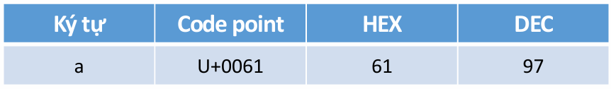
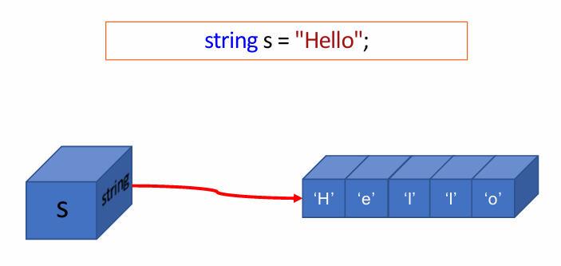

# 8. Chuỗi kí tự

<div align="center">
  <p>
    
    <strong><a style="text-decoration:none;" href="https://github.com/k1enn" target="_blank">GitHub</a></strong>
    
    <strong><a style="text-decoration:none;" href="https://codeforces.com/profile/dinhtrungkien" target="_blank">Codeforces</a></strong>
    
    <strong><a style="text-decoration:none;" href="https://www.linkedin.com/in/k1enn/" target="_blank">LinkedIn</a></strong>
  </p>
      <small> December, 2024</small>
</div>

## Bảng mã Unicode
**Unicode** là bảng mã chuẩn quốc tế được sử dụng để
mã hóa các ký tự của mọi ngôn ngữ trên thế giới.

**Unicode** có tổng cộng 1.114.111 code points và hiện
nay có hơn 96.000 mã số đã được gán cho các ký tự,
bao gồm:
- Ký tự có ký hiệu hiển thị: a, b, c, 1, 2, 3, ∈, ★,
 🫰,🌹,…
- Ký tự điều khiển (không có kí hiệu hiển thị): NUL, tab,
 newline,…
 Nguồn: https://home.unicode.org
 
**Unicode Transformation Format** (UTF) là thuật toán mã hóa mỗi Unicode code point sang một chuỗi byte để lưu trữ trên máy tính và ngược lại.

**3 cách mã hóa**:
- UTF-8: dùng từ 1-4 nhóm 8-bit.
- UTF-16: dùng từ 1-2 nhóm 16-bit.
- UTF-32: dùng cố định nhóm 32-bit.

Lên trang của [Unicode](https://home.unicode.org) coi thêm.

## Kiểu ký tự `char`
### Cú pháp (Syntax)


```csharp
static void Main(string[] args)
 {
    char ch1 = 'a';
    char ch2 = '\u0061’;      //Code point
    char ch3 = '\x61’;      //HEX
    char ch4 = (char)97;      //DEC
    Console.WriteLine("ch1 = {0}", ch1);  //ch1 = a
    Console.WriteLine("ch1 = {0}", ch2);  //ch2 = a
    Console.WriteLine("ch1 = {0}", ch3);  //ch3 = a
    Console.WriteLine("ch1 = {0}", ch4);  //ch4 = a
 }
```
### Các phép toán
1. **So sánh**
```cs
static void Main(string[] args)
 {
    char ch1 = 'a';
    char ch2 = 'b';
    Console.WriteLine(ch1 == ch2);  //False
    Console.WriteLine(ch1 != ch2);  //True
    Console.WriteLine(ch1 < ch2);   //True
    Console.WriteLine(ch1 <= ch2);  //True
    Console.WriteLine(ch1 > ch2);   //False
    Console.WriteLine(ch1 >= ch2);  //False
 }
```

2. **Tăng/giảm**
```cs
static void Main(string[] args)
{
   char ch1 = 'a';
   char ch2 = 'b’; 
   ch1++;
   Console.WriteLine(ch1 == ch2);  //True
   Console.WriteLine(ch1 != ch2);  //False
   Console.WriteLine(ch1 < ch2);   //False
   Console.WriteLine(ch1 <= ch2);  //True
   Console.WriteLine(ch1 > ch2);   //False
   Console.WriteLine(ch1 >= ch2);  //True
}
```

3. **Phép toán số học**: có toán hạng kiểu char thì phép toán được tính trên mã ký tự và tạo ra kết quả kiểu int
```cs
static void Main(string[] args)
 {
  char one = '1';    //dec: 49      
  int a = one - 48;  //a = 49 - 48 = 1      
  int b = '1' - '0'; //b = 49 - 48 = 1  

  char two = (char)(2 + '0’);  //(char)50 -> '2'
  char three = (char)(3 + 48); //(char)51 -> '3'
}
```
### Một số hàm thông dụng
- Chuyển đổi IN HOA -> in thường:
```cs
static char Char.ToLower(char c)
```

- Chuyển đổi in thường -> IN HOA
```cs
 static char Char.ToUpper(char c)
```

## Kiểu chuỗi ký tự `string`
- `string` là mảng một chiều chứa các ký tự
- `string` là kiểu dữ liệu tham chiếu (reference type)




### Cách khởi tạo chuỗi có chứa **ký tự đặc biệt**:
- Dùng Escape Characters: sử dụng dấu backslash `\`
```cs
 string s = "C:\\My Documents"; 
```
- Dùng Verbatim String Literal: đặt ký tự `@` trước chuỗi
```cs
string s = @"C:\My Documents";
```
Cái này khá tương tự String Literal ở `Javascript`, có thể dùng cho nhiều mục đích.

### Nhập chuỗi tiếng Việt từ bàn phím:
```cs
 Console.InputEncoding = Encoding.Unicode;
 string s = Console.ReadLine();
```
### Xuất chuỗi tiếng Việt lên màn hình Console:
```cs
 Console.OutputEncoding = Encoding.Unicode;
 Console.WriteLine("Nhập môn lập trình");
```
Nên thường một chương trình, mình sẽ để 2 dòng này ở đầu hàm Main cho đơn giản:
```cs
 Console.OutputEncoding = Encoding.Unicode;
 Console.InputEncoding = Encoding.Unicode;
```
### Thao tác trên `string`
Các thao tác trên chuỗi gần giống như thao tác trên
mảng một chiều chứa các ký tự nên không cần giải thích nhiều.
